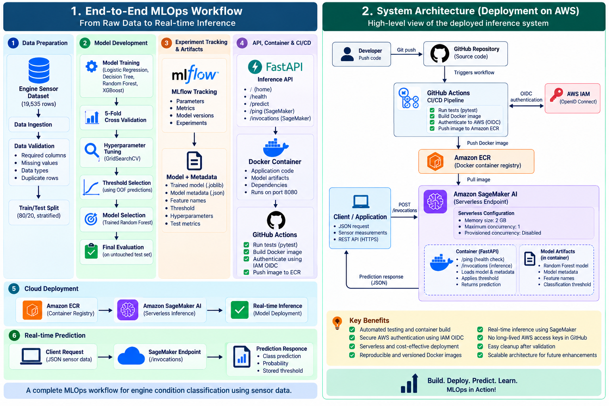
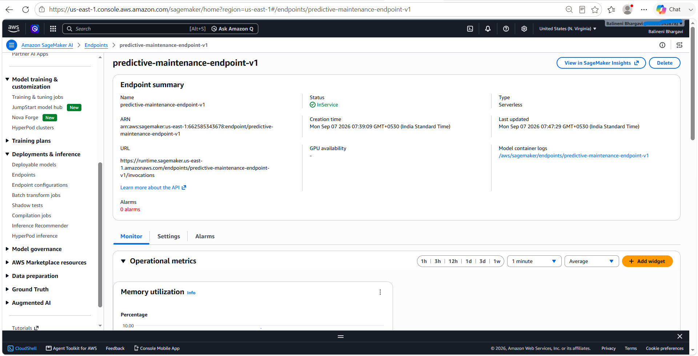
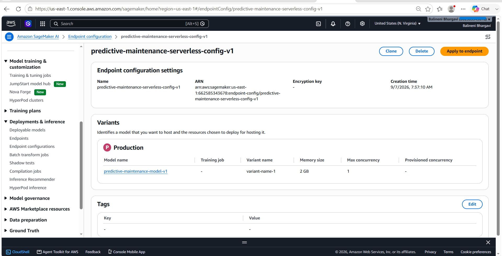
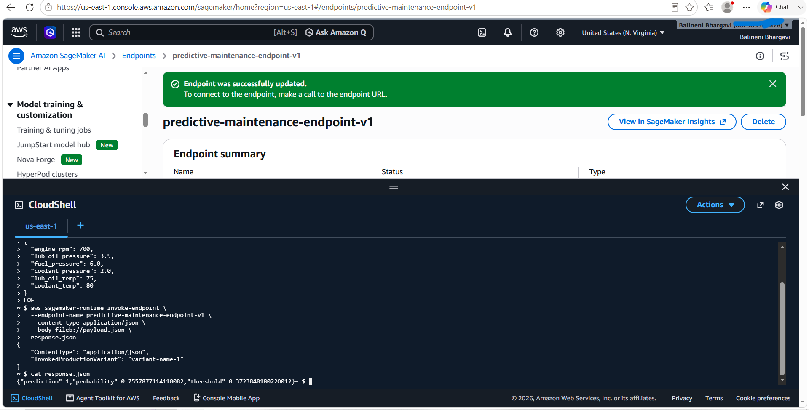
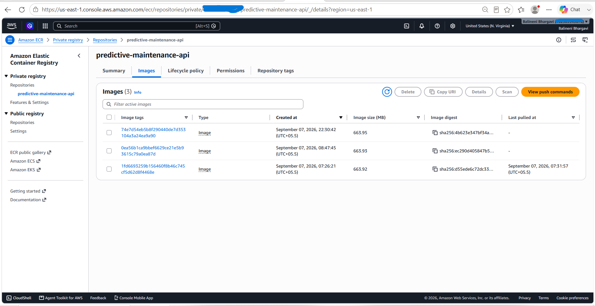
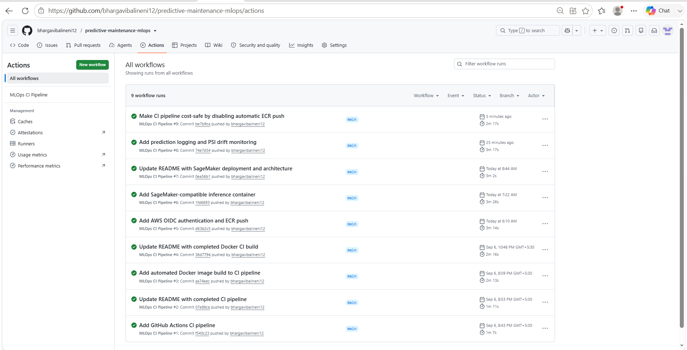

# Predictive Maintenance MLOps

An end-to-end **Machine Learning and MLOps project** for engine condition classification using sensor measurements, covering model development, experiment tracking, automated testing, containerization, CI/CD, Amazon ECR, and deployment using Amazon SageMaker AI Serverless Inference.

> **Note:** The available dataset contains independent sensor observations and a binary `Engine Condition` target. Therefore, this project performs **engine condition classification for predictive maintenance**, rather than Remaining Useful Life (RUL) or future time-to-failure prediction.

---

## System Architecture



The architecture is divided into four areas:

1. **Model Development** — data validation, preprocessing, model experimentation, cross-validation, hyperparameter tuning, MLflow tracking, threshold selection, and model packaging.
2. **CI/CD** — GitHub Actions runs automated tests, builds the Docker image, authenticates to AWS through IAM OIDC, and pushes the versioned image to Amazon ECR.
3. **AWS Deployment & Inference** — Amazon SageMaker AI uses the ECR image to create a model and expose it through a Serverless Inference endpoint.
4. **Monitoring & Observability** — prediction inputs and metadata are logged for monitoring, and production feature distributions are compared with the reference training distribution using PSI-based data drift detection.

---

## End-to-End Workflow

```text
Engine Sensor Dataset
        ↓
Data Ingestion & Validation
        ↓
Stratified Train/Test Split
        ↓
Baseline Model Training
        ↓
5-Fold Cross Validation
        ↓
MLflow Experiment Tracking
        ↓
Hyperparameter Tuning
        ↓
Random Forest Model Selection
        ↓
OOF Classification Threshold Selection
        ↓
Final Evaluation on Untouched Test Set
        ↓
Model + Metadata Artifacts
        ↓
FastAPI Inference Application
        ↓
Docker Container
        ↓
GitHub Actions CI/CD
        ↓
Amazon ECR
        ↓
Amazon SageMaker Model
        ↓
SageMaker Serverless Endpoint
        ↓
Real-time Cloud Inference
```

---

## Dataset

The dataset contains **19,535 observations** with six numerical sensor features and one binary target variable.

### Features

- Engine rpm
- Lub oil pressure
- Fuel pressure
- Coolant pressure
- lub oil temp
- Coolant temp

### Target

```text
Engine Condition
```

The target contains binary values:

```text
0
1
```

The project intentionally refers to these as class `0` and class `1` unless their physical meaning is established from authoritative dataset documentation.

---

## Data Validation

Before model training, the pipeline performs validation checks for:

- Required columns
- Missing values
- Target values
- Numerical feature types
- Duplicate rows

The raw dataset passes the implemented validation checks.

---

## Data Splitting

The dataset is divided into:

```text
Training set: 80%
Test set:     20%
```

A stratified split is used to preserve the target distribution.

```python
train_test_split(
    X,
    y,
    test_size=0.2,
    random_state=42,
    stratify=y
)
```

The final test set is kept untouched during model comparison, hyperparameter tuning, and classification-threshold selection.

---

## Model Experimentation

Four baseline machine learning models were evaluated:

- Logistic Regression
- Decision Tree
- Random Forest
- XGBoost

Each model was evaluated using **5-fold cross-validation**.

The following metrics were compared:

- Accuracy
- Precision
- Recall
- F1 Score
- ROC-AUC
- Average Precision

---

## MLflow Experiment Tracking

MLflow is used to track machine learning experiments.

For each experiment, the project records:

- Model name
- Model parameters
- Accuracy
- Precision
- Recall
- F1 Score
- ROC-AUC
- Average Precision

This provides a reproducible way to compare experiments instead of selecting a model based only on manually observed results.

---

## Baseline Model Results

| Model | Accuracy | Precision | Recall | F1 | ROC-AUC | Average Precision |
|---|---:|---:|---:|---:|---:|---:|
| Logistic Regression | 0.6618 | 0.6797 | 0.8770 | 0.7658 | 0.6883 | 0.7833 |
| Decision Tree | 0.5863 | 0.6735 | 0.6673 | 0.6704 | 0.5577 | 0.6593 |
| Random Forest | 0.6532 | 0.6952 | 0.8011 | 0.7444 | 0.6770 | 0.7770 |
| XGBoost | 0.6432 | 0.6911 | 0.7850 | 0.7351 | 0.6627 | 0.7707 |

These results represent the baseline configurations used in this project.

---

## Hyperparameter Tuning

Logistic Regression and Random Forest were selected for further tuning.

`GridSearchCV` with 5-fold cross-validation was used with:

```text
scoring = average_precision
```

### Tuned Logistic Regression

Best parameters:

```text
C      = 0.01
solver = liblinear
```

Best cross-validation Average Precision:

```text
0.7835
```

### Tuned Random Forest

Best parameters:

```text
n_estimators       = 200
max_depth          = 10
min_samples_split  = 5
min_samples_leaf   = 1
```

Best cross-validation Average Precision:

```text
0.7944
```

Among the tuning experiments performed, the tuned Random Forest achieved the strongest Average Precision and was selected as the final model candidate.

---

## Classification Threshold Selection

A binary classification model commonly starts with a probability threshold of `0.5`.

Instead of automatically using the default threshold, this project selects the threshold using **out-of-fold (OOF) predictions generated from the training data**.

```text
Training Data
     ↓
Cross-Validated OOF Predictions
     ↓
Precision-Recall Evaluation
     ↓
F1 Evaluation
     ↓
Threshold Selection
```

This ensures that the final test set is **not used for threshold optimization**.

Selected threshold:

```text
0.3724
```

The threshold is stored in the model metadata and reused during inference.

---

## Final Test Evaluation

After the model configuration and classification threshold were locked, the model was evaluated on the untouched test set.

| Metric | Score |
|---|---:|
| Accuracy | 0.6504 |
| Precision | 0.6481 |
| Recall | 0.9744 |
| F1 Score | 0.7785 |
| ROC-AUC | 0.6989 |
| Average Precision | 0.7981 |

### Confusion Matrix

```text
[[ 141 1303]
 [  63 2400]]
```

Using scikit-learn's standard binary class ordering:

```text
True Negatives  = 141
False Positives = 1303
False Negatives = 63
True Positives  = 2400
```

The selected threshold provides very high recall for class `1`, but it also produces a large number of false positives.

This demonstrates an important production ML consideration: **classification thresholds should be selected according to business costs and operational requirements rather than optimizing a metric without considering its consequences.**

---

## Model Packaging

The selected trained model is saved as:

```text
artifacts/model/random_forest_model.joblib
```

The corresponding model metadata is stored as:

```text
artifacts/metadata/model_metadata.json
```

The metadata contains:

- Model name
- Model version
- Feature names
- Selected classification threshold
- Hyperparameters
- Final test metrics

This ensures that the inference application uses the same feature ordering and classification threshold selected during model development.

---

## Standalone Inference

The inference layer loads the saved model and metadata without retraining.

```text
Input Sensor Measurements
        ↓
Load Saved Model + Metadata
        ↓
Predict Probability
        ↓
Apply Stored Threshold
        ↓
Return Prediction
```

This separates model training from production inference.

---

## FastAPI Model Serving

The trained model is exposed through a REST API using **FastAPI**.

### Local API Endpoints

```text
GET  /
GET  /health
POST /predict
```

### SageMaker-Compatible Endpoints

```text
GET  /ping
POST /invocations
```

`/ping` provides the health-check interface required by the SageMaker inference container.

`/invocations` handles inference requests when the container is hosted by SageMaker.

### Example Request

```json
{
  "engine_rpm": 700,
  "lub_oil_pressure": 3.5,
  "fuel_pressure": 6.0,
  "coolant_pressure": 2.0,
  "lub_oil_temp": 75,
  "coolant_temp": 80
}
```

### Example Response

```json
{
  "prediction": 1,
  "probability": 0.7557877114110082,
  "threshold": 0.3723840180220012
}
```

---

## Automated Testing

The project uses **pytest** for automated testing.

Current tests verify:

- API health endpoint
- Valid prediction requests
- Missing input field validation
- Model inference output
- Probability range
- Classification threshold range

Run all tests with:

```bash
python -m pytest tests/ -v
```

Current test status:

```text
4 passed
```

The same test suite is executed automatically by GitHub Actions.

---

## Docker Containerization

The FastAPI inference application is packaged into a custom Docker image containing:

```text
Application Code
        +
Model Artifacts
        +
Model Metadata
        +
Python Dependencies
        +
FastAPI / Uvicorn
```

The SageMaker-compatible container listens on:

```text
Port 8080
```

### Build the Image

```bash
docker build --load -f docker/Dockerfile -t predictive-maintenance-sagemaker .
```

### Run Locally in SageMaker-Style Mode

```bash
docker run --rm -p 8080:8080 predictive-maintenance-sagemaker serve
```

Swagger documentation:

```text
http://127.0.0.1:8080/docs
```

The container was locally validated using both:

```text
GET  /ping
POST /invocations
```

before being deployed to AWS.

---

## CI/CD with GitHub Actions

GitHub Actions automates testing, container creation, AWS authentication, and image publication.

```text
Git Push to main
       ↓
GitHub Actions
       ↓
Run pytest
       ↓
Build Docker Image
       ↓
Authenticate to AWS using IAM OIDC
       ↓
Login to Amazon ECR
       ↓
Tag Image with Git Commit SHA
       ↓
Push Image to Amazon ECR
```

### Passwordless AWS Authentication

The CI/CD pipeline authenticates to AWS using **IAM OpenID Connect (OIDC)**.

```text
GitHub Actions
       ↓
OIDC Identity Token
       ↓
AWS IAM Role
       ↓
Temporary AWS Credentials
       ↓
Amazon ECR
```

This avoids storing long-lived AWS access keys in GitHub.

---

## Amazon ECR

The inference container is stored in a private **Amazon Elastic Container Registry (ECR)** repository:

```text
predictive-maintenance-api
```

Images are tagged using their Git commit SHA.

This provides traceability between:

```text
Git Commit
    ↓
Docker Image
    ↓
ECR Image
    ↓
SageMaker Deployment
```

---

## Amazon SageMaker AI Deployment

The custom inference container was successfully deployed using **Amazon SageMaker AI Serverless Inference**.

### Deployment Flow

```text
Amazon ECR
     ↓
SageMaker Model
     ↓
Serverless Endpoint Configuration
     ↓
SageMaker Serverless Endpoint
     ↓
Real-time Prediction
```

The SageMaker model uses the custom Docker image stored in ECR.

The trained Random Forest model and metadata are packaged directly inside the inference image, so this deployment design does not require a separate S3 model-artifact URL.

### Serverless Configuration

```text
Memory size:              2 GB
Maximum concurrency:      1
Provisioned concurrency:  Disabled
```

Serverless inference was selected because this portfolio workload requires intermittent inference rather than a continuously provisioned inference instance.

---

## Real-Time Cloud Inference Validation

After the endpoint reached:

```text
InService
```

the deployed model was invoked through the **SageMaker Runtime API**.

### Invocation

```bash
aws sagemaker-runtime invoke-endpoint \
  --endpoint-name predictive-maintenance-endpoint-v1 \
  --content-type application/json \
  --body fileb://payload.json \
  response.json
```

SageMaker successfully routed the request to:

```text
InvokedProductionVariant: variant-name-1
```

### Cloud Prediction Response

```json
{
  "prediction": 1,
  "probability": 0.7557877114110082,
  "threshold": 0.3723840180220012
}
```

This validates the complete inference path:

```text
Client
   ↓
SageMaker Runtime
   ↓
Serverless Endpoint
   ↓
Custom Docker Container
   ↓
FastAPI /invocations
   ↓
Random Forest Model
   ↓
Stored Classification Threshold
   ↓
Prediction Response
```

---

## AWS Cost-Control Strategy

After successful cloud inference validation:

- The SageMaker endpoint was deleted
- The endpoint configuration was deleted
- Provisioned concurrency was never enabled

The SageMaker model definition and ECR image can be retained for reproducibility and future demonstrations.

This demonstrates an important cloud engineering practice: **create resources for a defined workload, validate the deployment, and remove unnecessary serving resources afterward.**

---

## Project Structure

```text
predictive-maintenance-mlops/
│
├── .github/
│   └── workflows/
│       └── ci.yml
│
├── app/
│   ├── __init__.py
│   └── app.py
│
├── artifacts/
│   ├── metadata/
│   │   └── model_metadata.json
│   └── model/
│       └── random_forest_model.joblib
│
├── data/
│   └── raw/
│       └── engine_data.csv
│
├── docker/
│   ├── Dockerfile
│   └── serve.py
│
├── docs/
│   └── images/
│       └── mlops-architecture.png
│
├── scripts/
│   ├── run_baseline_experiments.py
│   ├── run_model_selection.py
│   ├── run_tuning_experiments.py
│   ├── test_ingestion.py
│   └── test_prediction.py
│
├── src/
│   ├── data/
│   │   ├── ingestion.py
│   │   ├── preprocessing.py
│   │   └── validation.py
│   │
│   └── models/
│       ├── evaluate.py
│       ├── experiment.py
│       ├── predict.py
│       └── train.py
│
├── tests/
│   ├── test_api.py
│   └── test_model.py
│
├── .gitignore
├── requirements.txt
└── README.md
```

---

## Technologies Used

### Machine Learning

- Python
- Pandas
- NumPy
- Scikit-learn
- XGBoost

### Experiment Tracking

- MLflow

### Model Serving

- FastAPI
- Uvicorn

### Testing

- Pytest

### Containerization

- Docker

### Version Control & CI/CD

- Git
- GitHub
- GitHub Actions

### AWS

- Amazon ECR
- Amazon SageMaker AI
- SageMaker Serverless Inference
- AWS IAM
- IAM OIDC
- AWS CloudShell

---

## MLOps Roadmap

### Implemented

- [x] Data ingestion and validation
- [x] Stratified train/test split
- [x] Multiple model experimentation
- [x] 5-fold cross-validation
- [x] MLflow experiment tracking
- [x] Hyperparameter tuning
- [x] Training-only OOF threshold selection
- [x] Final untouched test evaluation
- [x] Model and metadata artifact packaging
- [x] FastAPI inference API
- [x] Automated pytest testing
- [x] Docker containerization
- [x] GitHub Actions CI
- [x] Automated Docker image build
- [x] AWS IAM OIDC authentication
- [x] Automated image push to Amazon ECR
- [x] SageMaker-compatible inference container
- [x] SageMaker Serverless deployment
- [x] Real-time cloud inference validation
- [x] Cloud resource cleanup after validation
- [x] Prediction logging for inference monitoring
- [x] PSI-based data drift detection
- [x] Minimum production sample window for drift evaluation
- [x] Structured JSON drift report generation
- [x] Drift monitoring automated tests

---

## AWS Deployment Evidence

The model was containerized with Docker, published to Amazon ECR through GitHub Actions using OIDC authentication, and successfully deployed to an Amazon SageMaker Serverless endpoint.

> **Cost-control note:** Billable cloud resources are cleaned up after deployment validation to avoid unnecessary ongoing AWS charges. Deployment evidence is retained in this repository.

### SageMaker Serverless Endpoint



### Serverless Inference Configuration



### Successful Cloud Inference



### Container Image in Amazon ECR



### Successful CI/CD Pipeline



---

### Future Enhancements

- [ ] Amazon S3-based production artifact storage
- [ ] SageMaker Model Registry
- [ ] CloudWatch logging and monitoring
- [ ] Model performance monitoring with delayed ground-truth labels
- [ ] Automated retraining pipeline
- [ ] Deployment promotion/versioning strategy
- [ ] Feature management / Feature Store where appropriate
- [ ] Additional production security and governance controls

---

## Key MLOps Concepts Demonstrated

This project demonstrates:

- Modular ML development
- Data validation
- Reproducible train/test splitting
- Multiple model experimentation
- Cross-validation
- MLflow experiment tracking
- Hyperparameter tuning
- Leakage-aware threshold selection
- Untouched final test evaluation
- Model artifact packaging
- Metadata-driven inference
- REST API model serving
- Automated testing
- Docker containerization
- Git-based version control
- CI/CD using GitHub Actions
- Git commit-to-container traceability
- IAM OIDC authentication
- Temporary AWS credentials for CI/CD
- Amazon ECR container registry
- Custom SageMaker inference containers
- SageMaker Serverless Inference
- Real-time cloud model invocation
- Cloud resource cost-control and cleanup

---

## Key Learning Outcome

This project demonstrates that MLOps extends beyond training a machine learning model.

```text
Data
 ↓
Validation
 ↓
Experimentation
 ↓
Model Selection
 ↓
Artifact Packaging
 ↓
API Serving
 ↓
Testing
 ↓
Containerization
 ↓
CI/CD
 ↓
Container Registry
 ↓
Cloud Deployment
 ↓
Inference Validation
 ↓
Operational Cleanup
```

The project combines **machine learning development, software engineering, CI/CD, containerization, cloud infrastructure, and model serving** into one end-to-end MLOps workflow.

---

## Author

**Bhargavi Balineni**

Aspiring MLOps Engineer | Cloud Engineering Experience